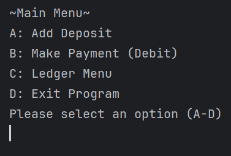
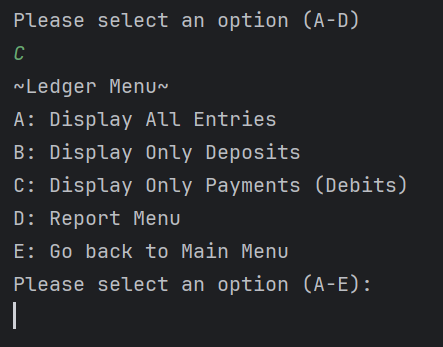
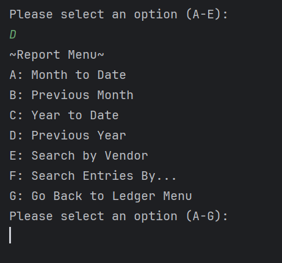
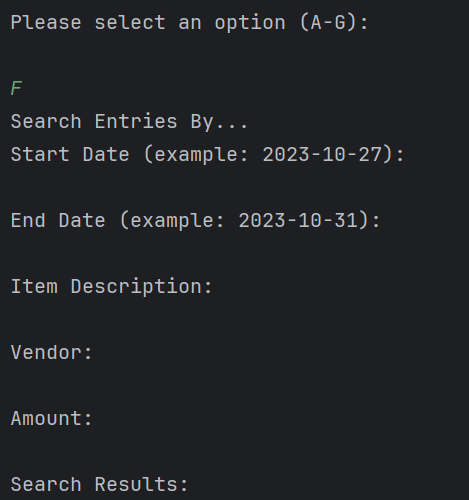

# LedgerLytics: JavaFundamentals
## **Capstone Project**

## Table of Contents:

- [Overview](#overview)
- [Project Structure](#project-structure)
- [Features and Usage](#features-and-usage)
  - [Main Menu](#main-menu)
  - [Ledger Menu](#ledger-menu)
  - [Report Menu](#report-menu)
- [Code Highlight](#code-highlight)
  - [Custom Search](#custom-search)
- [Acknowledgments](#acknowledgements)

## Overview
My application, LedgerLytics, is an Accounting Ledger utilizing CLI. 
This application allows users to record Deposits, make Payments (Debit), track Financial transactions and generate 
various Reports. 
Overall, the application can be utilized for business or personal purposes, involving maintaining financial 
activities.

## Project Structure
### **Java Classes**
- Data: Represents and Formats Data (Date, Time, Description, Vendor, and Amount).
- MainMenu: Main Menu for the application (Entry and Exit point).
- MOptions: Handles Deposits and Payments.
- LedgerMenu: Ledger Menu for the application.
- LOptions: Handles ledger-related functions, displaying entries.
- ReportMenu: Report Menu for the application.
- ROptions: Handles report-related functions, generating and displaying reports.
- Custom: Handles custome search functions, generating a report based off search criteria inputs.

## Features and Usage
### **Main Menu** 
- Launch the application to access initial Main Menu.
- The main menu screen displays, showcasing the following options:
  - A: Add Deposit
    - Records Deposit entries, provided by user input values(Vendor, Item Description, and Amount).
    - Entries will be saved to the "ledger" (transactions.csv file).
  - B: Make Payment (Debit)
    - Records Payment (Debit) entries, provided by user input values(Vendor, Item Description, Amount).
  - C: Ledger Menu
    - Accesses the Ledger Menu Screen.
  - D: Exit Application
    - Closes Application.

### **Ledger Menu**
- Displayed data will be ordered by most recent to oldest entries.
- Accessed from option "C" from the Main Menu, displays ledger menu screen. Showcasing the following options:
  - A: Display All Entries
    - User is able to view all financial entries.
  - B: Display Only Deposits
    - User is able to view only deposit entries (positive amounts).
  - C: Display only Payments
    - User is able to view only payment (debit) entries (negative amounts).
  - D: Report Menu
    - Accesses the Report Menu Screen.
  - E: Go back to Main Menu.
    - Returns user to Main Menu Screen.

### **Report Menu**
- Accessed from option "D" from the Ledger Menu, displays report menu screen. Showcasing the following options:
  - A: Month To Date
    - User is able to view all entries within the current month.
  - B: Previous Month
    - User is able to view all entries within the previous month.
  - C: Year To Date
    - User is able to view all entries within the current year.
  - D: Previous Year
    - User is able to view all entries within the previous year.
  - E: Search By Vendor
    - Prompts user for vendor name, displaying all entries related.
  - F: Search Entries By...
    - Performs a custom search based on field input(s) from user (Start Date, End Date, Item Description, Vendor, or 
    Amount)
      - Filters through entries based on search criteria('s), displaying all entries related.
  - G: Go back to Ledger Menu
    - Returns user to Ledger Menu Screen

## Code Highlight

### **Custom Search**
- The "Custom" class, a feature of the application, filters entries based on a variety of criteria:
  - Start Date
  - End Date
  - Item Description
  - Vendor
  - Amount
- Narrows down data, providing a precise and tailored search.

## Acknowledgements

### **Java Stream API Tutorials:**
- https://www.oracle.com/technical-resources/articles/java/ma14-java-se-8-streams.html

#### **README Writing Guide**
- https://www.freecodecamp.org/news/how-to-write-a-good-readme-file/

#### **Input Validation on Stack Overflow**
- https://stackoverflow.com/questions/1809093/how-can-i-place-validating-constraints-on-my-method-input-parameters

#### **Filtering Objects on User Input on Stack Overflow**
- https://stackoverflow.com/questions/54137852/filtering-objects-from-collection-based-on-user-choice-input

#### **Java Filters Documentation**
- https://www.oracle.com/java/technologies/filters.html

#### **Exception Handling in Java**
- https://www.baeldung.com/java-exceptions

#### **Java CSV Parsing**
- https://mkyong.com/java/how-to-read-and-parse-csv-file-in-java/

#### **CSV File Format**
- https://en.wikipedia.org/wiki/Comma-separated_values
